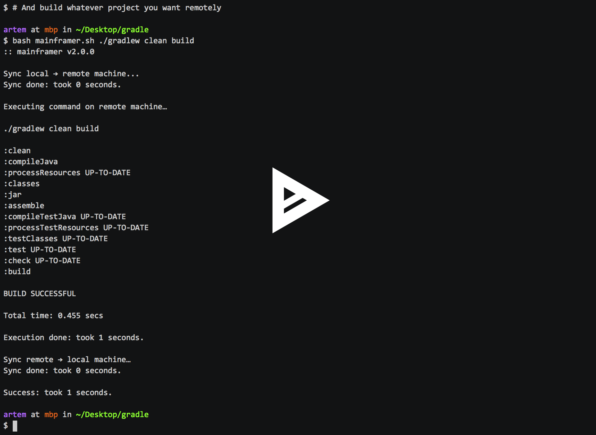

# mainframer

Tool that allows you to move build process from a local machine to a remote one.

Remote machine ought to be much faster than a laptop. 
With `mainframer` you can free up your local machine for better things —
like editing source code in your IDE without lags and
freezes, being able to actually _use_ your computer when the build is happening.

## Supported Actions

`mainframer` supports basically anything you can execute as a command.
It will sync files to remote machine, execute a command and sync files back.

We have quite a bunch of samples showing off some practical applications.

* [Gradle](samples/gradle)
* [Gradle Android](samples/gradle-android)
* [Rust](samples/rust)
* [Clang](samples/clang)
* [GCC](samples/gcc)
* [Maven](samples/mvn)
* [Buck](samples/buck)
* [Go](samples/go)

## Setup

* [Remote machine](docs/SETUP_REMOTE.md)
* [Local machine](docs/SETUP_LOCAL.md)
* [Configuration](docs/CONFIGURATION.md)

## Demo

[](https://asciinema.org/a/101327)

### How to Run Tests (for contributors)

Dependencies: Bash, Docker.

```console
$ ci/build.sh
```

## License

```
Copyright 2017 Juno, Inc.

Licensed under the Apache License, Version 2.0 (the "License");
you may not use this file except in compliance with the License.
You may obtain a copy of the License at

   http://www.apache.org/licenses/LICENSE-2.0

Unless required by applicable law or agreed to in writing, software
distributed under the License is distributed on an "AS IS" BASIS,
WITHOUT WARRANTIES OR CONDITIONS OF ANY KIND, either express or implied.
See the License for the specific language governing permissions and
limitations under the License.
```
